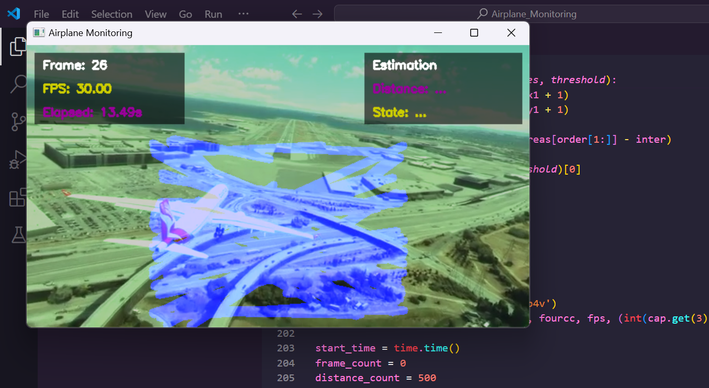

## Airplane Runway Detection and Tracking
This project detects and tracks airplane approaching and landing on a runway using a combination of deep learning model and image processing techniques. It processes video frames to identify runways, detect airplane, estimate distances, and determine airplane states. 



### Features
- Runway line detection using a pre-trained TensorFlow model.
- Airplane detection using YOLOv5.
- State(Landing, Taking Off, On Runway, Approaching) and distance estimation based on airplane position and runway proximity.

 
### Requirements
````
pip install -r requirements.txt
````